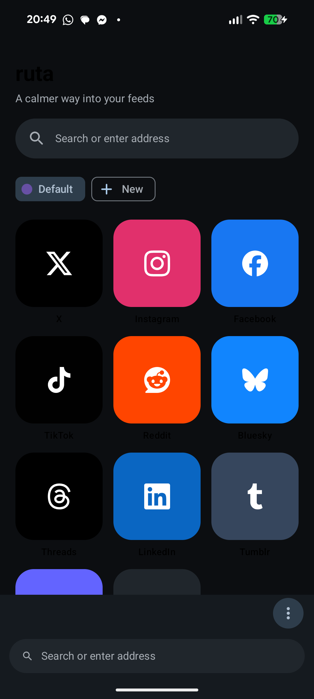
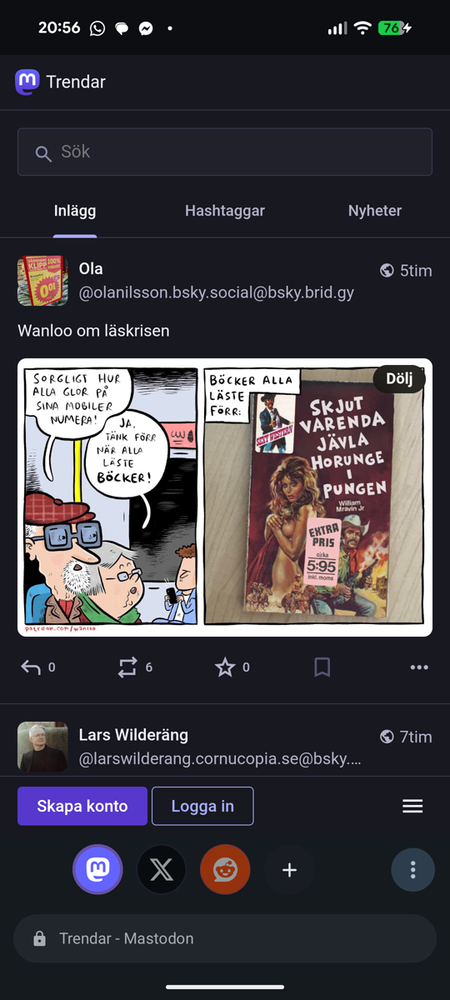

# ruta

**One calm, private home for all your social feeds.**

ruta puts the social sites you already use — X, Instagram, Facebook, TikTok, Reddit, Bluesky,
Threads, LinkedIn, Tumblr and Mastodon — into a single clean Android app, with ads and trackers
blocked. No separate apps, no clutter, no tracking.

  
  &nbsp;&nbsp;
  

## Features

- **All your feeds, one app.** A simple grid of social sites — tap to open. Add any other site too.
- **Ads & trackers blocked** out of the box (EasyList + EasyPrivacy). Add your own filter lists anytime.
- **Multiple accounts, kept separate.** Each account gets its own isolated profile; flick between them from the bottom dock.
- **Force dark mode** on any website — on by default.
- **Download videos & images** straight from Instagram, TikTok and X.
- **Cleaner links** — strips `utm_*`, `fbclid` and other tracking junk when you copy.
- **Make it yours** — per-site custom CSS, a built-in proxy, desktop-site toggle, hide the address bar.
- **No tracking, no ads, no accounts** — zero analytics or third-party SDKs; ruta never reports on you. Its only own network calls are for ad-block lists and site icons.
- **Modern & beautiful** — Material You design with dynamic color, dark/light, edge-to-edge.

## Install

- **Download the APK** from the [Releases](../../releases) page and open it on your phone.
- **F-Droid** — coming soon.
- **Build it yourself** — open in Android Studio and run, or `./gradlew :app:assembleRelease`.

Works on Android 8.0+ (no Google services required).

## License

Open source under the [Apache License 2.0](LICENSE). Ad/tracker blocking uses the community
EasyList and EasyPrivacy lists (GPLv3 / CC BY-SA), downloaded at runtime — full attribution is in
the app's About screen.
